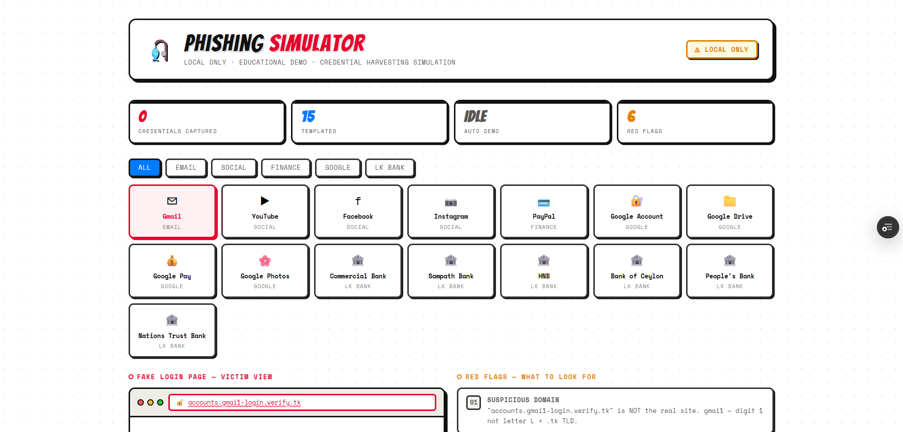
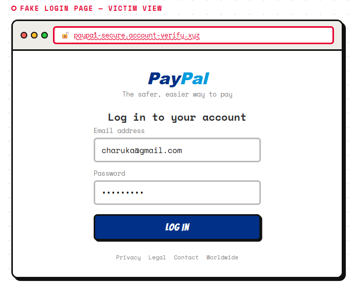
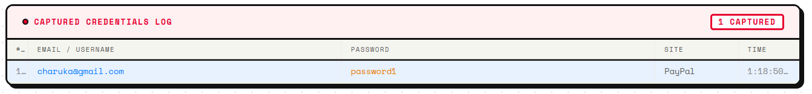
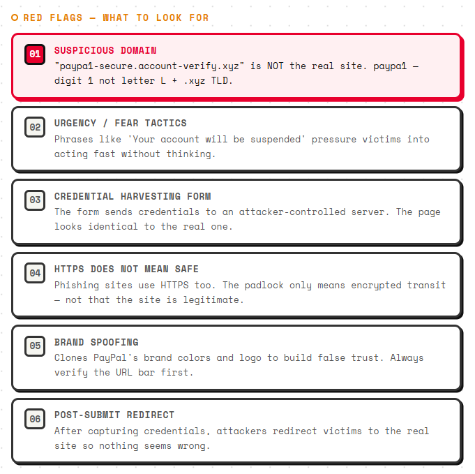

# 🎣 Phishing Awareness Simulator

> **⚠ Educational Use Only**
>
> This project runs entirely inside the browser. No credentials are transmitted, stored, or sent to any external service.

An interactive React-based cybersecurity training tool that demonstrates how phishing websites imitate legitimate services and trick users into revealing sensitive information.

The simulator provides realistic phishing page replicas, suspicious domain analysis, credential capture demonstrations, and phishing red-flag education to help users recognize and avoid common social engineering attacks.

---

# 📖 Overview

Phishing remains one of the most common cyberattacks used to steal usernames, passwords, banking details, and personal information.

This simulator recreates realistic phishing scenarios using familiar websites and banking portals to demonstrate:

- How attackers impersonate trusted brands
- How fake login pages collect credentials
- How suspicious domains are used to deceive users
- How social engineering tactics influence victim behavior
- What warning signs users should look for before entering credentials

All demonstrations occur locally within the browser and are intended solely for cybersecurity awareness and training purposes.

---

# ✨ Features

### 🎭 Realistic Phishing Templates

Includes phishing simulations based on:

- Gmail
- YouTube
- Facebook
- Instagram
- PayPal
- Google Account
- Google Drive
- Google Pay
- Google Photos
- Commercial Bank
- Sampath Bank
- Hatton National Bank (HNB)
- Bank of Ceylon (BOC)
- People's Bank
- Nations Trust Bank

### 📂 Category Filtering

Browse phishing scenarios by category:

- Email
- Social Media
- Finance
- Google Services
- Sri Lankan Banking

### 🚩 Phishing Red Flag Detection

Highlights common warning signs including:

- Suspicious domains
- Fake login pages
- Urgency and fear tactics
- Brand impersonation
- Credential harvesting
- Redirect-after-login techniques

### 📊 Live Credential Capture Demonstration

Demonstrates how phishing sites collect credentials by displaying entered data inside a local educational log.

### 🤖 Automated Demonstration Mode

Automatically simulates user interactions across multiple phishing templates for presentations, demonstrations, and awareness training sessions.

### 🌐 Fake Browser Interface

Includes a simulated browser address bar showing suspicious domains, misleading URLs, and phishing indicators.

---

# 🚩 Phishing Indicators Covered

| Indicator | Description |
|------------|------------|
| Suspicious Domain | Typosquatting, lookalike domains, misleading subdomains |
| Urgency Tactics | Messages designed to pressure users into immediate action |
| Credential Harvesting | Fake login forms used to collect sensitive information |
| HTTPS Misconceptions | Demonstrates why HTTPS alone does not guarantee legitimacy |
| Brand Spoofing | Use of trusted logos, colors, and branding to build false trust |
| Post-Login Redirects | Redirecting victims to legitimate websites after credential capture |

---

# 🎯 Learning Objectives

This project helps users learn how to:

- Identify phishing websites
- Detect suspicious URLs and domains
- Recognize social engineering tactics
- Understand credential harvesting attacks
- Analyze fake login pages
- Improve personal cybersecurity awareness
- Reduce susceptibility to phishing attacks

---

# 🏛️ Included Templates

| Category | Platforms |
|-----------|-----------|
| Email | Gmail |
| Social Media | YouTube, Facebook, Instagram |
| Finance | PayPal |
| Google Services | Google Account, Google Drive, Google Pay, Google Photos |
| Sri Lankan Banking | Commercial Bank, Sampath Bank, HNB, Bank of Ceylon, People's Bank, Nations Trust Bank |

---

# ⚙️ Technology Stack

- React.js
- JavaScript (ES6+)
- HTML5
- CSS3
- React Hooks
- CSS-in-JS Styling
- Google Fonts

### No Backend Required

- No Database
- No APIs
- No External Network Requests
- No Credential Storage
- Runs Completely Client-Side

---

# 🚀 Installation

## Clone the Repository

```bash
git clone https://github.com/YOUR_USERNAME/phishing-awareness-simulator.git
cd phishing-awareness-simulator
```

## Install Dependencies

```bash
npm install
```

## Start Development Server

```bash
npm start
```

## Create Production Build

```bash
npm run build
```

---

# 📸 Screenshots

### Dashboard



### Phishing Simulation



### Credential Capture Demonstration



### Red Flag Analysis



---

# 🎓 Example Use Cases

- Cybersecurity Awareness Training
- University Security Demonstrations
- Information Security Coursework
- Phishing Education Workshops
- Security Awareness Campaigns
- Ethical Hacking Presentations
- Employee Security Training

---

# 📂 Project Structure

```text
phishing-awareness-simulator/
│
├── public/
│
├── src/
│   ├── App.js
│   ├── index.js
│   └── PhishingSimulator.jsx
│
├── screenshots/
│   ├── dashboard.png
│   ├── simulation.png
│   ├── credentials.png
│   └── analysis.png
│
├── .gitignore
├── LICENSE
├── README.md
├── package.json
└── package-lock.json
```

---

# ⚠ Disclaimer

This project was developed exclusively for cybersecurity education, awareness training, and research purposes.

No credentials are transmitted, stored, or shared. All captured data remains inside browser memory and is removed when the page is refreshed or closed.

This project must not be used to deceive, impersonate, or collect information from real users.

The author assumes no responsibility for misuse of this software.

---

# 👨‍💻 Author

**Charuka**

Cybersecurity Student | Information Security Enthusiast

---

# 📄 License

Licensed under the MIT License.

Free to use for educational, academic, and cybersecurity awareness purposes.
